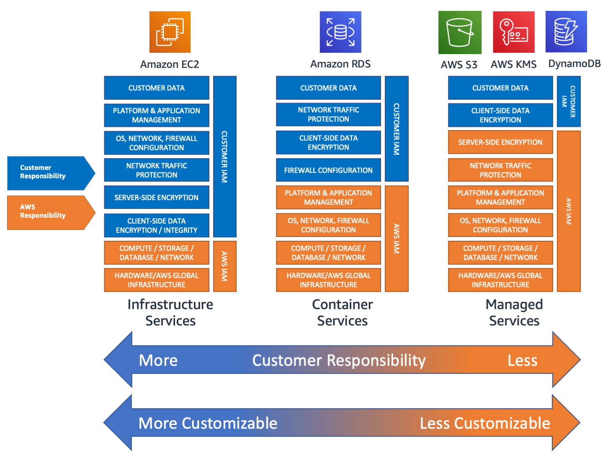

# Apuntes: Semana 4 Clase 1
**Fecha: 16/08/2022**  
**Autor: Deyan Sanabria Fallas #2021046131**

# Esquema con mapReduce:
Sistema distribuido donde cada uno de los nodos se llama workers y realizan procesamiento de datos. Un coordinador recibe la solicitud de un usuario y asigna a cada uno de sus workers un tamaño de Partición.
- Particiones pequeñas que se puedan recuperar del storage son mejores porque se pueden mover de un solo tracto, evitando context switching. Un tamaño usualmente usado es el de 256 mb.
- Comando [REDUCE](https://www.mongodb.com/docs/v5.0/reference/command/mapReduce/#std-label-cmd-mapreduce-reduce): función que “reduce” a un solo objeto todos los valores asociados a una llave en particular.

# Red/Internet/Ethernet

## Bare Metal Servers: 
Maquina que tiene un NAS o SAN que está conectado por fibra, es manejado y administrado por los usuarios. (Modelo que ya no se usa en nuestros días).
- El storage y la comunicación entre nodos se hace por ethernet.
- Ethernet: Protocolo de capa de acceso al medio, que se encarga de mover datos. Usa cobre como material conductor. 

## Historia de una empresa de marketing: 
Hicieron un servidor en una de las torres gemelas y un backup en la otra, al caer las torres se perdió todo. En conclusión, mejor tener datacenters regionales en diferentes ubicaciones.
- Datacenters: accesos entre datacenters entre una misma región, es rápido, tiene conexiones directas. Entre diferentes regiones se hace por internet, lo cual lo hace lento.

# Cuello de botella en Redes:

## Si la memoria no es suficiente: 
El sistema se va a ver obligado a paginar, por lo que vamos a tener uso de red y el storage se pondrá cerca del 100% debido a que va a tener que mover paginas de un lado a otro y el CPU se pondrá al 100% por hacer llamadas al sistema operativo.

## Si tenemos una baja asignación de IOPS: 
El cuello de botella estará entre la memoria y el storage. El CPU estará con un uso alto porque estará con el sistema operativo esperando a que le llegue la señal de que los datos han sido traídos.

# Particiones/Shards
Agarran el dataset y lo dividen en pedacitos y están en cada uno de los nodos. Deberían distribuirse uniformemente dentro de los worker nodes que tenemos. Si no se hace puede provocar que varias máquinas queden sin usarse. La idea es que cada Particion/Shard pueda entrar en memoria.
- Bases de datos NoSQL: Shard
    - En bases de datos NoSQL es ideal hacer particiones basados en un criterio. Ej: índice por fecha (MM-YYYY), de esta forma es pequeño el shard y nos permite tener los datos más accedidos (eligiendo un criterio acorde), con acceso rápido.
- Bases de datos SQL: Partición

# Spark
Se comporta como una base de datos NoSQL.

## Funciones/Metodos
>- spark.read.options(): leer datos
>
>- Función map: Map(“delimiter” -> “,”, ”quote” -> “\”” ,”header” -> “true”, ”multiline” -> “true”)
>    - Header -> true: Que la primera línea del archivo va a contener los nombres de las columnas
>    - Multiline -> true: Indica que hay datos multilínea.
>    - delimiter -> “,”: Indica el separador de datos.
>    - quote -> “\””: Indica entre que están los datos.
>
>- csv(filename)
>
>- printSchema: imprime el esquema de la base de datos.
>
>- createOrReplaceTempView(name): crea una tabla temporal.
>
>- spark.sql(query): ejecuta un query SQL

## Spark es Lazy
Al ser lazy, todas las transformaciones que hacemos no se ejecutan hasta que se necesiten ejecutar, por ende, cambiar el nombre de un archivo puede causar errores. Al hacer la lectura solo lee las primeras 100 líneas y asume que está bien.
- Transformation channing: crea un árbol de transformaciones que están asociadas unas a las otras. Tiene que ocurrir un evento (action) para que estas se ejecuten.
- Con el comando **persist** va a cortar el transformation channing y va a guardar en memoria la información y no la tiene que recalcular.
- En sistemas distribuidos el order by es una de las operaciones más demandantes.
- [Funciones de spark](https://spark.apache.org/docs/latest/api/sql/index.html)

## Spark Conectores
Viene preparado para hablar con otras plataformas. Se puede hacer procesamiento de datos en Spark y pasarlo a elasticsearch. 

# Esquema de Responsabilidad

  
