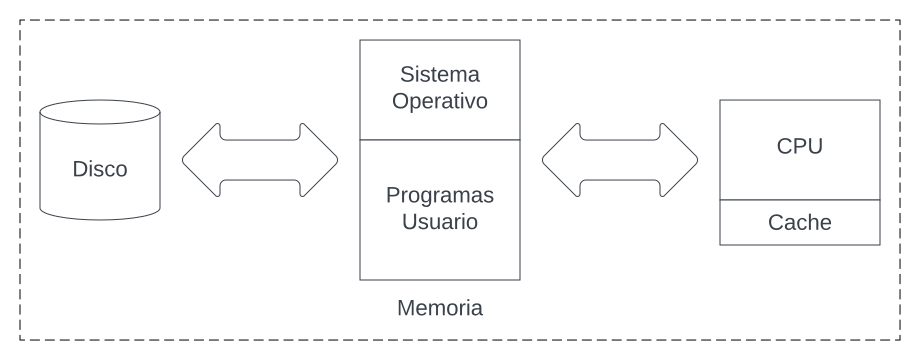

# Examen #1
**Fecha: 11/11/2022**  
**Autor: Deyan Sanabria Fallas #2021046131**

# Pregunta 1:
Time No More es la red social más pequeña jamás creada, es conocida como one word social 
network (OWSN), este término fue acuñado por un profesor mientras diseñaba un examen, el 
funcionamiento es muy simple, como en cualquier otra red social las personas pueden tener amigos y 
postear mensajes, pero en este caso son simples mensaje con una palabra.
En sus primeros 2 meses, Time No More logró reunir cerca de 500 mil usuarios, con un volumen de queries 
de escrituras (nuevos posts) de 5 posts por segundo y un volumen de queries de lectura de 100 queries 
por segundo.

Originalmente esta OSWSN fue creada en una base de datos relacional, se puede asumir que es un motor 
MariaDB standalone en se encuentra la casa de uno de los fundadores, esto está causando muchos 
problemas de rendimiento y se estima que en menos de 4 meses si el crecimiento se mantiene como en 
los dos primeros meses la base de datos colapsará.

Esta red social, aunque simple se ha hecho popular, ya que permite entre otras cosas, mostrar el estado 
de ánimo, exponer deseos, aspiraciones, y otros, todo en una sola palabra, lo cual es sumamente 
conveniente para hacer análisis de mercadeo y además simplifica los modelos de inteligencia artificial.
También entre la juventud se hizo muy popular enviar mensajes palabra por palabra o hasta construir 
historias, donde cada persona escribe una palabra con un hashtag (máximo 1) y mediante el tiempo de 
inserción en la base de datos, se va construyendo una historia, esto ha sido utilizado por grupos con malas 
intensiones para enviar mensajes inapropiados o coordinar grupos de odio, que normalmente evitan 
enviar el hashtag para evitar ser descubiertos, al ser una base de datos relacional y alser una característica 
muy utilizada, la base de datos relacional no está funcionando correctamente ya que los queries duran 
mucho tiempo.

Cada registro de la base de datos Time No More, tiene el siguiente formato.

## Tabla **post**:

|  id   |  timestamp  |  hashtag   |  palabra  |  id_usuario   |  latitud  |  longitud   |
| :--:  | :---------: | :-------:  | :-------: | :----------:  | :-------: | :--------:  |

## Tabla **usuario**:

|  id   |  nombre  |  apellidos   |  telefonos  |  pais   |  estado  |  zip   |
| :--:  | :------: | :---------:  | :---------: | :----:  | :------: | :---:  |

## Tabla **amigos**:

|  id_usuario1   |  id_usuario2  |
| :-----------:  | :-----------: |

En calidad de CTO de la compañía Timeouts No More, ustedes han sido contactados o contactadas para 
ayudar a Time No More e intentar solucionar el problema, por esta razón debe realizar las siguientes 
tareas:

* Dar una solución detallada de cómo podría mejorar el rendimiento de la base de datos actual, reduciendo el downtime al mínimo, esto permitirá ganar tiempo para dar una solución mucho más duradera con la mínima afectación a los usuarios. (10 pts)
    * Respuesta: De las primeras opciones que se me vienen a la cabeza, seria convertir esa base de datos standalone en una con múltiples replicas, esto provocaría poder tener un mayor número de consultas, esto sumado a que las réplicas tengan *”eventual consistency”*, puesto que en una red social como esta no es crucial tener los datos más actuales y podemos permitirnos tener datos algo tardíos, lo que nos permitiría que si hay una escritura sobre un dato, se puedan seguir permitiendo lecturas sobre el mismo pero una versión más antigua, esto lograría aumentar el volumen de lecturas por segundo muchísimo y aumentar las escrituras pero no tanto por el tema de locks a recursos que causan las mismas, por lo que si se escribe algo aunque haya consistencia eventual, las escrituras deben esperar a que la escritura actual termine.  
    Adicionalmente, el modelo actual de la base tiene ciertos problemas de normalización, como los hashtags que pueden ser repetidos múltiples veces, sin embargo, crear una tabla para eso puede no ser beneficioso para el rendimiento ya que se tendría que buscar en otra tabla por un dato, lo que tomaría algo más de tiempo.  

* Dar una recomendación detallada de que tipo de base de datos se debería utilizar para abordar este problema, además debe recomendar algunas de las bases de datos SQL o NoSQL estudiadas durante el curso tanto en lecturas, así como las utilizadas en proyectos o ejemplos en clase. Tome en cuenta que sería posible utilizar más de una base de datos para optimizar el almacenamiento de los datos de la tabla post, amigos y usuario, tome en cuenta que tan fácil es escalar la base de  datos en su recomendación, debe dar prioridad a servicios managed services y SaaS, no olvide la  localidad y naturaleza de los datos. (30 pts)
    * Respuesta: Recomendaría el uso de una base de datos SQL como lo puede ser MariaDB, de la cual ya están familiarizados y también recomendaría a Elasticsearch de base de datos NoSQL, y las usaría de la siguiente manera:  
        * MariaDB: Para MariaDB tendría la tabla usuarios y amigos antes mostrada, pero de una forma un tanto distinta. La tabla de usuario habría que normalizarla, iniciando por los apellidos, que por gusto personal yo pondría apellido1 y apellido2. Después en teléfonos, haría una tabla exclusiva para los teléfonos donde tuviera un id, el número de teléfono y el id del usuario al que le pertenece. Siguiendo con País y estado, en este caso haría una tabla País con su id y nombre y una tabla estado con id, nombre e id del país. Con eso creo que ya sería suficiente de normalización. Y la tabla amigos creo que la dejaría como tal.  
        * Elasticsearch: Al ser una base de datos NoSQL y no preocuparse por muchas de las cosas de consistencia de las bases de datos SQL, el rendimiento que brinda Elasticsearch es muy superior al de MariaDB, en esta base almacenaría los posts publicados por las personas. Elasticsearch tiene un mecanismo de scores el cual, cuando se realiza una query de búsqueda, va a poner en orden de score los documentos más relevantes. Esta función nos serviría ya que al ser una red social nos beneficia saber que es lo más relevante, algo así como los trendings de twitter o de otras redes sociales.  

    * Para Elasticsearch podemos montar la base de datos como una “Time series database”, es muy probable que los posts entre más viejos, menos relevantes van a ser, por lo que ir cambiándolos de data tiers a unos cada vez más baratos y fáciles de mantener es una buena opción, esto nos garantiza poder escalar el almacenamiento de forma fácil, probablemente se tenga que aumentar de forma frecuente un data tier frozen o cold, y mediante un poco de observabilidad se tenga la información suficiente para saber en qué épocas del años, puede ser durante un evento, se tenga que aumentar la capacidad de data tiers más “calientes” para poder mantener el ritmo de la cantidad de datos nuevos entrantes.  
    Con MariaDB creo que se podría ahorrar un poco de costes porque no creo que se le exija tanto como a Elasticsearch, se podría proveer con un sistema de masters y slaves con consistencia eventual, de tal forma que podamos tener la mayor cantidad de lecturas las cuales van a ser más frecuentes que las escrituras porque para escrituras dependemos más de cuantos usuarios nuevos hay y cuantas amistades nuevas hay, por lo que no hay tanta preocupación de ese lado.  
    Cabe resaltar que todo esto recomendando montarlo en servicios de cloud computing como lo puede ser AWS, debido a que estamos limitados si uno de los fundadores mantiene los servidores. Esto nos da la ventaja de habilitar varios servidores y backups en diferentes regiones geográficas que conforme la aplicación vaya haciéndose más famosa, se podrían ir expandiendo.  
    Con respecto a Managed Services/SaaS, no hay mucho que decir, es una buena opción para una red social pequeña, pero le quita mucha customización ya que en este tipo de servicios, los proveedores como AWS se encarga de hacer toda la base de datos y ellos son responsables de prácticamente todas las cosas.
 

* Comente acerca de que tan conveniente es mantener la base de datos actual en la casa de uno de los fundadores, comparado con mover ésta algún Cloud Provider como AWS. (10 pts)
    * Respuesta: Realmente no es muy conveniente, esto significa múltiples desventajas, primero, ellos son completamente responsables de lo que ocurra con el hardware físico de la base de datos, por lo que cualquier falla, ellos tendrían que buscar una solución.  
    Segundo, esto imposibilita un plan en contra de catástrofes muy efectivo, debido a que no se pueden tener respaldos en zonas distintas a la de la base principal,porque como lo dice la pregunta, se estaría manteniendo en la casa de uno de los fundadores.  
    Tercero, expandir el hardware es más complicado, esto va de la mano con el primer punto ya que ellos tienen que buscar el hardware, comprarlo, armarlo, montarlo y un montón de cosas extra, mientras que un servicio de cloud computing como AWS, de todo eso se encarga AWS.  
    Cuarto, no hay posibilidad de alta disponibilidad, si en la zona donde está la base de datos ocurre algo, no habría forma de mantener la red social activa por solo existir en una zona la base de datos.  
    Igual, se tendría la ventaja de ellos son los jefes de su propio hardware por lo que pueden manipularlo de la forma que ven más conveniente, sin embargo, trae todas las desventajas anteriores. Con un servicio como AWS, ellos se encargan de la mayor parte del trabajo pesado y mientras los dueños pueden encargarse de la parte más importante para su negocio.  

* Basándose en el funcionamiento de un índice invertido el cual fue estudiado en clase y es utilizado por motores como Elasticsearch y el concepto de Natural Languaje Processing (NLP) llamado Stemming el cual también fue discutido en clase, comente ¿Cómo se podría reducir el memory footprint de la base de datos actual? (10 pts)
    * Respuesta: El concepto de stemming se refiere a obtener la raíz de una palabra en vez de sus versiones conjugadas para guardar espacio. Aproximadamente el índice invertido funciona con un diccionario de términos, donde se guardan las palabras con un ID y una “posting list” donde se guarda el ID y donde aparecen dichas palabras. La forma de optimizar este proceso es omitir todas las palabras inútiles para el procesamiento del texto, palabras que no brindan ningún tipo de información, dentro de este proceso ocurre el stemming.  
    Teniendo esto en cuenta, en el contexto de la base de datos, se guardan las palabras en una columna especifica, es probable que dentro de la red social se hagan búsquedas sobre las palabras o hashtags, por lo que lo ideal sería tener un índice en estas columnas, pero llegados a un punto serian demasiado grandes como para entrar a memoria.  
    Aquí es donde entran los conceptos de índices invertidos y stemming. Se podría indexar de tal forma donde solo las partes importantes de las palabras se indexen y se guarden sus apariciones como punteros a donde se encuentran. De esta forma se podría reducir el memory footprint al hacer los índices más pequeños. Adicionalmente podríamos mezclarlo con índices parciales, donde indexamos solo hashtags recientes, pero eso dependería si les sirve a los dueños de la base.

# Pregunta 2:
Comente, ¿Cómo afectan los índices en el rendimiento de las bases de datos relacionales?, enfoque su respuesta tanto en como benefician el rendimiento así la forma en la cual lo impactan de forma negativa. Suponiendo que el hardware no es un problema (se puede comprar cuanto se necesite), ¿Podemos crear cuantos índices queramos o estos no tendrán mayor impacto en el rendimiento?

* Respuesta: Los índices nos permiten buscar de forma rápida elementos dentro de la base de datos. Podemos indexar columnas para buscar elementos de una columna en específico. Hay que saber hacer la indexación pues si ocupamos dos columnas, pero solo una está indexada, perdemos todos los beneficios de la indexación. Podemos incluso hacer la indexación sobre expresiones, de tal forma que, si buscamos la suma de algo, ya este preprocesado y se busque en el índice.  
Realmente el beneficio de rendimiento se encuentra en las búsquedas, teniendo una columna indexada, no hay que pasar por todos los registros de forma secuencial para encontrar un elemento. Pero para que este beneficio exista, debemos asegurarnos de que el índice entre en memoria, porque si no, vamos a tener que recurrir al “swaping”, lo que causaría perdida de rendimiento del índice.  
Otras formas de perder rendimiento con el uso de índices van a depender del tipo de índices y las estructuras de datos que utilicen dichos índices. A la hora de insertar un elemento o cambiarlo, los índices van a necesitar recalcularse, en, por ejemplo, un árbol balanceado, donde la gracia es poder hacer comparaciones y para buscar de forma rápida en tiempo logarítmico, balancear el árbol para que tenga la menor altura posible. Por lo que tiempo adicional a la hora de insertar va a ocurrir.  
Adicionalmente, crear demasiados índices va a requerir usar más espacio en disco, por lo que mantenerlo será más caro.  
Con respecto a crear cuantos índices queramos, teniendo todo el dinero disponible para comprar, no valdría la pena, si bien es cierto que las búsquedas pueden ser rápidas, a la hora de tener que actualizar índices va a ser un problema, en una sola tabla se podría crear un índice por columna, un índice que tenga todos los pares posibles de las columnas, otro índice con todos los tríos posibles de las columnas, y así hasta el infinito, a la hora de actualizar índices va ser bastante lento y más si el tipo de índice es complejo, como que sea una expresión.

# Pregunta 3:

 

Figura 1

El rendimiento de todo sistema de base de datos puede verse afectado por muchos factores, uno de ellos es el ambiente en el cual se ejecuta, este se encuentra compuesto por los componentes de hardware y el sistema operativo y otros programas de usuario compitiendo por los recursos del computador. Comente de forma clara y concisa, ¿Cómo afecta el rendimiento de una base de datos los componentes ilustrados en la Figura 1? 

* Respuesta: Para explicar esta parte, la siguiente lista:
    * Disco:  El disco tiene dos limitantes, los IOPS (Input/Output Operations Per Second) y el tamaño. En este caso como es rendimiento, vamos a obviar el tamaño. El disco va a limitar el rendimiento de la base de datos si los IOPS que este puede realizar no satisfacen la demanda de la base de datos, lo que provocaría un cuello de botella en el sistema.

    * Sistema Operativo: El Sistema Operativo es un problema para cualquier programa debido a que los programas que necesiten información del disco tienen que pasar primero por el sistema operativo, el cual se encarga de buscar los datos y pasárselos a los programas. Adicionalmente se encarga del context switching. El problema que tienen las bases de datos con el Sistema Operativo es que pedir datos y que los obtenga el sistema operativo es una operación muy costosa y requiere de bastantes recursos.

    * Programas del Usuario: Para una base de datos, si no está aislada de otros programas, puede que el sistema operativo cause context switching, lo cual es un mecanismo para simular que todos los programas corren a la vez y cuando le toca a un programa usar el CPU se tienen que guardar los registros para cuando el programa anterior vuelva a usar el CPU, puedan obtenerse los registros y continuar con su ejecución. Por obvias razones, esto es una tarea demandante y estaría limitando el rendimiento de la base de datos.

    * Memoria Principal: La memoria principal tiene dos limitantes, el espacio y su velocidad, no se entrará mucho en detalle de su velocidad, pues, claramente entre más rápida menos problemas se tienen. Pero en el tema del espacio es muy importante para la base de datos, pues es la memoria más grande y veloz a la que tiene acceso la base de datos, cuando la memoria principal no tiene suficiente espacio o no es lo suficientemente grande, ocurre el “swaping” que es el intercambio de datos con el disco debido a que la memoria está llena, esto se hace por páginas, por lo que si la base llena la memoria, esta va a empezar a intercambiar datos de manera continua con el disco para compensar la falta de espacio de la memoria principal, lo que reduce muchísimo el rendimiento.

    * CPU: El CPU es el encargado de realizar las operaciones que le son proveídas, este tiene tres limitantes, frecuencia de reloj, cantidad de núcleos y cantidad de hilos, esto va a definir cuanto paralelismo real tenemos en el sistema. La frecuencia de reloj nos va a dictar que tan rápido es un núcleo al procesar algo, la cantidad de núcleos e hilos nos van a definir cuantos “clientes” de forma simultánea va a poder atender la base de datos, por lo que el rendimiento de la base puede depender de esto.

    * Caché: La cache es una memoria que por lo general se encuentra muy cerca del CPU, lo que la hace muy rápida, aun más rápida que la memoria principal, pero suele tener mucho menos espacio, por lo que se suele almacenar datos que son frecuentemente usados para no tener que ir a traerlos de la memoria principal. Esto hace que la base de datos sea más rápida, pues, los datos más frecuentemente usados por la base de datos van a estar a disposición siempre y cuando no sean tan aleatorios.

# Pregunta 4:
La escalabilidad automática es una característica muy deseada en los sistemas de bases de datos tanto SQL como NoSQL, la misma permite mediante la obtención de métricas en tiempo real interpretar el comportamiento actual para predecir el comportamiento futuro, con esto se puede ajustar tanto el hardware como la configuración de las bases de datos, para poder atender el workload de un sistema. Comente la importancia de la Observabilidad tanto a nivel de aplicación como de base de datos para lograr una escalabilidad automática adecuada, ¿Considera que las métricas de memoria, CPU y disco son suficientes para lograr ésta?

* Respuesta: La palabra observabilidad viene de la palabra “observar", y se refiere a todas esas herramientas que utilizamos para observar el comportamiento de los programas. En el caso de las bases de datos, la observabilidad nos ayuda a encontrar patrones de comportamiento dentro de las mismas y nos pueden ayudar a identificar cuando es necesario cambiar por un hardware más potente, expandir nuestra base de datos o cambiar algún aspecto de la base de datos, ya sea agregar una tabla, agregar un índice, etc.  
El poder que brinda la observabilidad es poder ver múltiples métricas y poder relacionarlas entre sí para entender que está pasando con la base de datos. Si los componentes como la memoria principal esta al máximo, el disco está usándose al máximo y se están realizando múltiples búsquedas dentro de la base de datos, podríamos identificar que un índice demasiado grande que está llenando la memoria entre otras muchas cosas.  
En el caso que tengamos aplicaciones usando bases de datos con acceso a observabilidad, podríamos estudiar su comportamiento para encontrar donde están los cuellos de botella. Una aplicación compuesta por múltiples módulos independientes en un sistema productor-consumidor, puede tener ralentizaciones en uno de sus componentes, con observabilidad podríamos darnos cuenta si esto es debido a que la base de datos está limitando el rendimiento o el componente no es lo suficientemente rápido y podríamos aumentar la cantidad de este para acelerar el proceso.  
En el tema de métricas, no creo que sea adecuado solamente tener métricas de memoria, CPU y disco para lograr una correcta escalabilidad automática, muy fácil es hacer todo a fuerza bruta y si un componente se está quedando atrás, simplemente buscamos la forma de aumentarle la potencia, pero es algo poco sostenible y poco realista, por lo que se necesita más información para determinar cuándo es el momento correcto de aumentar hardware, porque aumentar hardware porque si y el problema realmente  se encuentra en la base de datos, no va a solucionar el verdadero problema.   

