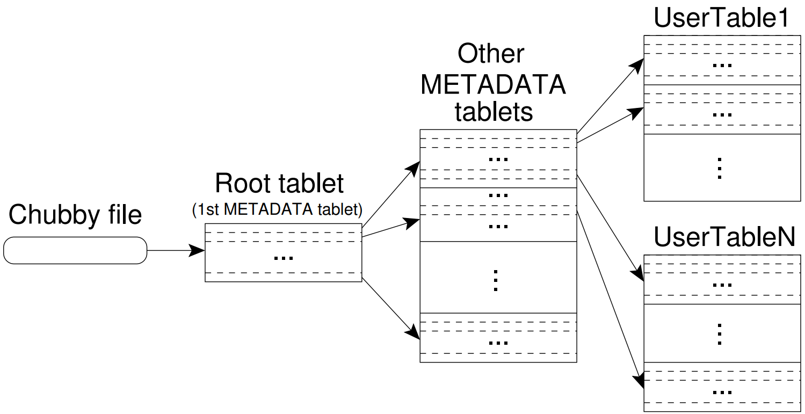
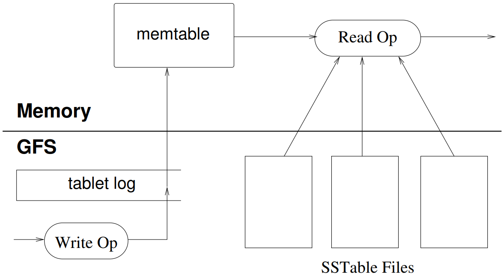
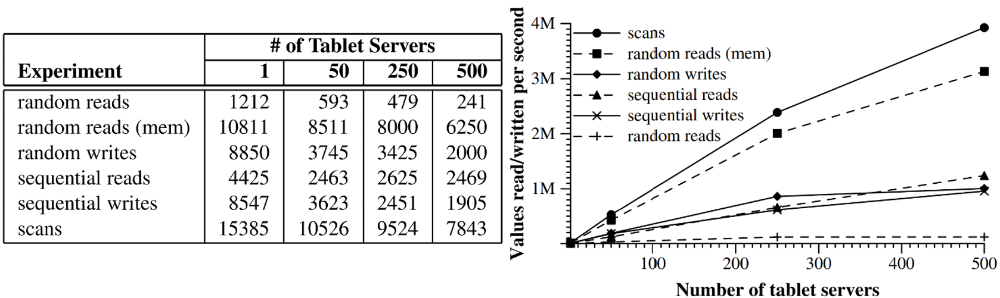

       

    Instituto Tecnologico de Costa Rica 

  Sede Central de Cartago 

  Escuela de Computación 

 Resumen 2 y 3 (R2 y R3) 

  IC-4302 Bases De Datos II GR 1 

  Estudiantes: Deyan Sanabria Fallas #2021046131 

  Profesor: Gerardo Nereo Campos Araya 

  Fecha de Entrega: 30/08/2022 

  Segundo Semestre 2022 

# Indice

1. [Bigtable](#bigtable)

2. [Data Model](#data-model)

3. [API](#api)

4. [Bulding Blocks](#bulding-blocks)

5. [Implementation](#implementation)
        
    5.1. [Tablet Location](#tablet-location)

    5.2. [Tablet Assignment](#tablet-assignment)

    5.3. [Tablet Serving](#tablet-serving)

    5.4. [Compactions](#compactions)

6. [Refinements](#refinements)

7. [Performance Evaluation](#performance-evaluation)

8. [Real Applications](#real-applications)

9. [Lessons](#lessons)

# Bigtable
Distributed storage for managing structured data designed to scale to a very large size, designed to scale to petabytes of data and thousands of machines. Bigtable archives:
> * Wide applicability.
> * Scalability.
> * High performance.
> * High Availability.

Bigtable uses ranges from throughput-oriented batch-processing to latency-sensitive serving of data. Bigtable share things with databases: Parallel DB and main-memory DB. it doesn’t support a full relational data model, it provides a simple data model with dynamic control over data layout and format. Data is indexed using row and column names.

# Data model
Bigtable is a sparse, distributed, persistent multidimensional sorted map. The map is indexed by a row key, column key, and a timestamp.
>**Row keys**: Arbitrary strings, up to 64KB in size, every read or write in a row key is atomic.
>   * Lexicographic order by row.
>   * Each row range is called a tablet and is dynamically partitioned.
>   * Reads of short row ranges are efficient and require communication with a small number of machines.
>   * URLs hostname components are reversed to group pages in the same domain.

>**Column Keys**: Grouped into column families
>   * All data in a column family is usually of the same type
>   * Column families must be created before data can be stored. After creation, column keys in the family can be used.
>   * Column keys follow this syntax: family: qualifier
>   * Access control and both disk and memory accounting are performed at the column family level.

>**Timestamps**:
>   * Each cell contains multiple versions of the same data indexed by timestamps of 64-bit integers >represented in microseconds.
>   * Assigned by Bigtable or explicitly by client applications (must generate unique timestamps to >avoid collisions).
>   * Store in decreasing timestamp order to read the most recent first.
>   * Bigtable can garbage-collect cell versions automatically, client can specify only the last n >versions or only new-enough versions.

# API
* Provides functions for creating and deleting tables and column families. Functions for changing cluster, table, and column family metadata, such as access control rights.
* Supports single-row transactions
* Doesn’t support general transactions across row keys, although it provides an interface for batching writes across row keys at the clients.
* Allows cells to be used as integer counters.
* Supports execution of client-supplied scripts. The scripts are written in Sawzall.
* Doesn’t allow client scripts to write back into Bigtable but can transform data.
* Bigtable can be used with MapReduce as both an input source and output target for MapReduce jobs.

# Bulding Blocks
* Bigtable uses Google File System to store log and data files
* A Bigtable cluster operates in a shared pool of machines, processes often share the same machines with processes from other applications and depends on a cluster management system
* SSTable file format is used internally to store Bigtable data, it contains a sequence of blocks (64KB by default). A block index is used to locate blocks and the index is loaded into memory when the SSTable is opened. Can be completely mapped into disk
* Lookup can be performed by finding the appropriate block with a binary search and then reading the block from disk.
* Bigtable relies on Chubby. It consists of five active replicas; one is a master and actively serve requests. Chubby uses Paxos algorithm and provides a namespace that consist of directories and small files. If Chubby becomes unavailable for an extended period, Bigtable becomes unavailable.
* Bigtable uses Chubby for: ensuring that there one active master; storing the bootstrap location of Bigtable data; discovering tablet servers and finalize tablet server deaths; to store Bigtable schema information; and to store access control lists.

# Implementation
Three major components: Library linked into every client, one master and many tablet servers. Tablet servers can be dynamically added or removed from a cluster when workload changes. The master is responsible for assigning tablets to tablet servers, detecting the addition and expiration of tablet servers, balancing tablet-server load, and garbage collection of files in GFS. 

Each tablet server manages a set of tablets and handles read and write requests. Client data doesn’t move through the master, clients communicate with tablet servers for reads and writes.

## Tablet Location
* Three-level hierarchy:

  

## Tablet Assignment
Each tablet is assigned to one tablet server at a time. Bigtable uses Chubby to keep track of tablet servers. The master is responsible for detecting when a tablet server is no longer serving its tablets, and for reassigning those tablets as soon as possible. When a master is started by the cluster management system, it needs to discover the current tablet assignments before it can change them. The master scans the METADATA table to learn the set of tablets. One complication is that the scan of the METADATA table cannot happen until the METADATA tablets have been assigned.

## Tablet Serving

  

## Compactions
As write operations execute, the size of the memtable increases. When it reaches a threshold, the memtable is frozen, a new memtable is created, and the frozen memtable is converted to an SSTable and written to GFS, this is a minor compaction and has two goals: Shrinks memory usage and reduces the amount of data needed to be read from a commit log during recovery. Every minor compaction creates a new SSTable. A merging compaction that rewrites all SSTables into exactly one SSTable is called a major compaction.

# Refinements
> * Locality Groups: Clients can group multiple column families together into a locality group.
> * Compression: Clients can control whether the SSTables for a locality group are compressed, and if so, which compression format is used.
> * Caching for read performance: To improve read performance, tablet servers use two levels of caching: The Scan Cache and The Block Cache.
> * Bloom filters: number of accesses are reduced by allowing clients to specify that Bloom filters should be created for SSTables in a particular locality group.
> * Commit-log implementation: Append mutations to a single commit log per tablet server, comingling mutations for different tablets in the same physical log file
> * Speeding up tablet recovery: If the master moves a tablet from one tablet server to another, the source tablet server first does a minor compaction on that tablet.
> * Exploiting immutability: various parts of the Bigtable system have been simplified by the fact that all the SSTables generated are immutable.

# Performance Evaluation

  

>Scaling: Aggregate throughput increases dramatically, by over a factor of a hundred, the number of tablet servers increase in the system from 1 to 500. However, performance does not increase linearly.

# Real Applications
As of August 2006, there are 388 non-test Bigtable clusters running in various Google machine clusters:
* Google Analytics
* Google Earth
* Google's Personalized Search

# Lessons
* Large distributed systems are vulnerable to many types of failures, not just the standard network partitions and fail-stop failures assumed in many distributed protocols.
* It is important to delay adding new features until it is clear how the new features will be used.
* Proper system-level monitoring is Important.
* Simple designs are very valuable.

